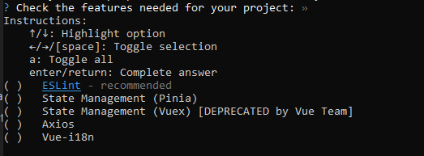
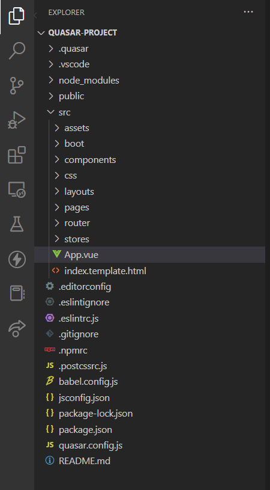

# Quasar Framework

Quasar Framework är ett ramverk baserat på Vue som förenklar utvecklingen av applikationer avsevärt.

## Resurser
<a href="https://quasarcast.com">Quasar Videos</a>

# Skapa ett Quasar Projekt

Skriv in följande kommandon i terminalen på en plats där du vill ha dina Quasar projekt.
```
$ npm i -g @quasar/cli
$ npm init quasar
```

Vid frågorna som dyker upp välj svaren enligt nedan val:
När frågan vilka feature du vill ha, bocka av ESLint genom mellanslag tangenten.



```
$ npm init quasar
Need to install the following packages:
  create-quasar
Ok to proceed? (y) y


 .d88888b.
d88P" "Y88b
888     888
888     888 888  888  8888b.  .d8888b   8888b.  888d888
888     888 888  888     "88b 88K          "88b 888P"
888 Y8b 888 888  888 .d888888 "Y8888b. .d888888 888
Y88b.Y8b88P Y88b 888 888  888      X88 888  888 888
 "Y888888"   "Y88888 "Y888888  88888P' "Y888888 888
       Y8b

√ What would you like to build? » App with Quasar CLI, let's go!
√ Project folder: ... quasar-project
√ Pick Quasar version: » Quasar v2 (Vue 3 | latest and greatest)
√ Pick script type: » Javascript
√ Pick Quasar App CLI variant: » Quasar App CLI with Webpack
√ Package name: ... quasar-project
√ Project product name: (must start with letter if building mobile apps) ... Quasar App
√ Project description: ... A Quasar Project
√ Author: ... abbjetmus <jeton.mustini@abbindustrigymnasium.se>
√ Pick your CSS preprocessor: » Sass with SCSS syntax
√ Check the features needed for your project: »

 Quasar • Generating files...

 - babel.config.js
 - quasar.config.js
 - README.md
 - .editorconfig
 - .gitignore
 - .npmrc
 - .postcssrc.js
 - jsconfig.json
 - package.json
 - public/favicon.ico
 - src/App.vue
 - src/index.template.html
 - .vscode/extensions.json
 - .vscode/settings.json
 - public/icons/favicon-128x128.png
 - public/icons/favicon-16x16.png
 - public/icons/favicon-32x32.png
 - public/icons/favicon-96x96.png
 - src/assets/quasar-logo-vertical.svg
 - src/boot/.gitkeep
 - src/components/EssentialLink.vue
 - src/layouts/MainLayout.vue
 - src/pages/ErrorNotFound.vue
 - src/pages/IndexPage.vue
 - src/router/index.js
 - src/router/routes.js
 - src/css/app.scss
 - src/css/quasar.variables.scss
√ Install project dependencies? (recommended) » Yes, use npm
```

För att starta projektet måste man cd in i det först enligt:

```
$ cd quasar-project
$ npx quasar dev
```

Om man öppnar projektet i Visual Studio Code så ser mapp strukturen enligt.

</a>

Den mappen som vi endast behöver fokusera på 99% av tiden är **src**-mappen.

* **assets**  
I assets så lägger man in bilder och andra resurser som man vill ha på hemsidan.
* **boot**  
I boot sätter man upp användning av 3:e parts kod tex om man använder Firebase eller ett graf-bibliotek.
* **components**  
I components lägger man in mindre vue-komponenter t.ex. en sektion av en sida.
* **css**  
I css mappen finns filer att justera CSS för hela hemsidan.
* **layouts**  
I layouts finns MainLayout komponenten som är den layout som används förr alla sidor.
* **pages**  
I pages skapar man komponenter som blir en hel sida i applikationen.
* **router**  
I router definerar man hur url eller sökvägarna ser ut till dem olika sidorna i applikationen tex /home ska gå till startsidan och /about ska gå till om-oss sidan osv.
* **stores**
I stores kan man definera data som blir tillgängligt över alla komponenter.

## Ny fil i pages
När du skapar en ny sida i Quasar använd den här mallen dvs <q-page></q-page> componenten högst upp direkt under <template></template>.
Sidan ska ligga i pages mappen. Byt ut även denna kod mot det som finns i IndexPage.vue.
Har inte script-taggen `<script setup>` setup i sig så är det fel.

```html
<template>
  <q-page>

  </q-page>
</template>

<script setup>
import {ref} from 'vue'

</script>
```

## Ny fil i components
När du skapar en ny sida i Quasar använd den här mallen dvs `<q-page></q-page>` componenten högst upp direkt under `<template></template>`.
Komponenten ska ligga i components-mappen.

```html
<template>
 
</template>

<script setup>
import {ref} from 'vue'

</script>
```

## Övning 0. Skapa ett nytt Quasar projekt
1. Skapa ett nytt Quasar projekt enligt instruktionerna ovan och inkludera inte ESLint.
2. Öppna sedan projektet i webbläsaren.
3. Bekanta dig med mapparna innanför **src**-mappen.

## Övning 1. Importera en component till IndexPage
1. Skapa en komponent som heter `MyCardComponent` som innehåller ett valfri card som du hämtar från Quasar Components.
2. Importera sedan MyCardComponent till IndexPage och använd det i html-delen. Kolla i Vue powerpointen hur man gör.

## Övning 2.1 Ny sida (Page) och navigering
1. Skapa en ny sida som du döper *MyTestPage.vue* innanför pages mappen.
2. Lägg in mall koden för en page som inkluderar q-page.
3. Lägg till en `route` (rutt/path/url) för den sidan som heter 'my-test' i filen `src/router/routes.js`.
4. Använd en länk med `<router-link>` och navigera till MyTestPage från IndexPage och gärna en länk som navigerar tillbaka.

## Övning 2.2 Ny sida (Page) och navigering från javascript
1. Skapa en knapp i IndexPage.vue
2. Koppla knappen till en funktion som heter goToMyTestPage()
3. Funktionen goToMyTestPage ska navigera till MyTestPage.vue. 
4. Importera `useRouter` och använd router.push() funktionen.

## Övning 3. Flexbox i Quasar

## Övning 4. Jobba med bakgrundsfärger och färger i Quasar

## Övning 5. Jobba med text och typografi i Quasar